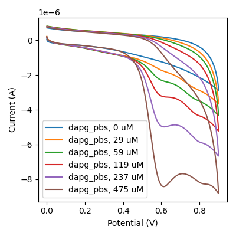

 <nav class="simple-nav" style="display: flex; justify-content: space-between; margin: 20px 0; padding: 15px 0; border-top: 2px solid #c2956cff;"> <a href="Training Weeks" style="color: #c2956cff; text-decoration: none; font-weight: 600; padding: 8px 16px; border: 2px solid #c2956cff; border-radius: 4px; transition: all 0.3s ease;">← Previous Post</a> <a href="Skill Based Approach" style="color: #c2956cff; text-decoration: none; font-weight: 600; padding: 8px 16px; border: 2px solid #c2956cff; border-radius: 4px; transition: all 0.3s ease;">Next Post →</a> </nav>

# Objective
[[Skills Based Approach]]
My primary goal over this time was to train a Large Language Model (LLM) to answer general [[Cyclic Voltammograms|cyclic voltemmetry]] (CV) questions, specifically evaluated using a multiple choice format. This project represents the core focus for the remainder of my internship, requiring me to design a comprehensive project plan and to build a complete pipeline for training, error analysis, and iterative improvement.

# Background Context

This work fits into a larger vision for the lab: developing systems that can analyze electrochemical data more efficiently and accurately. The potential impact is significant - if successful, this model could accelerate research workflows and provide consistent, reliable analysis of complex electrochemical datasets.

What makes this project particularly meaningful for me is the level of independence I was given. I designed the specifications, developed the pipeline strategy, and was entrusted with a portion of the research budget to bring this vision to life. 

> [!example] Here's an example of the kind of question we want to be able to answer:
> 

 
  
 
Here are cyclic voltammograms of DAPG in PBS at increasing concentrations. Does it follow the expected trend of strictly increasing peak ratio with concentration? 
A) Yes, the peak at 0.2 V increases monotonically with increasing concentration
B) No, the 59 uM peak is higher than the 29 uM peak 
C) Yes, the peak height at 0.6 V increases roughly linearly with increasing concentration 
D) No, the recorded concentrations are not linearly spaced
 

# Implementation

Rather than simply training the model to produce correct answers, I wanted to train it to  **think correctly** - establishing a foundation for future Reinforcement Fine-Tuning (RFT). Without access to a team of data labelers or large sets of pre-labeled questions, I had to develop creative solutions.

My strategy involved several key components:

- **Manual Data Curation**: I took controlled CV's in our lab and manually indexed and labeled the results to create a high-quality foundation
- **Programmatic Graph Generation**: I made an algorithm to to programmatically generate controlled graph variations (for example a graph  Ferrocene at two concentrations) while preserving important metadata
- **AI-Assisted Question Generation**: I developed highly engineered prompts to use AI tools for generating questions, answers, and reasoning traces based on the input graphs

*Pipeline flowchart showing data flow from raw CV data to trained model*

The technical implementation included Python scripts for dataset generation, pandas and JSON for data management, OpenAI API integration with batch processing capabilities, and creating comprehensive web tools for dataset visualization and evaluation. I created a robust error analysis system that allowed me to identify specific failure points and iterate improvements more efferently. 

*evaluation web app integration*

I used statistical tools like bootstrapping to generate confidence interval of model performance, giving insight into performance and variability. Over three weeks, I completed three major iterations, making targeted improvements each time before ultimately deciding to change strategy based on the insights gained.

# Challenges & Solutions

**Week 1 Challenge**: Initial error analysis revealed the model wasn't actually examining the graphs - it was attempting to answer questions through hallucination rather than visual analysis.

**Solution**: I mixed peak-pointing data into the training dataset and reformulated reasoning traces to explicitly emphasize graph examination and visual analysis skills.

**Weeks 2-3 Challenge**: While the model began looking at graphs, it struggled to identify features on the graph *correctly* despite two iterations of improved formatting, prompt engineering, and increased variation. Although the model showed incremental improvements, progress was slowing significantly. 

> [!caution] Problem
> 
> Despite demonstrating peak-finding skills in isolation, the model could not effectively transfer this ability to question-answering contexts. 

**Solution**: Recognizing that continuing this approach would be too time-intensive with diminishing returns, I made the decision to take the lessons from these iterations and develop an entirely new approach to tackle this challenge.

> [!tip] Opportunity
> 
> I learned a lot through these iterations and the quality of my work was much better than a couple weeks ago. Instead of banging my head against this wall, I could try a new approach with newfound insight and experience.

*Graph showing model performance over iterations or error analysis tool*

# Results/Next Steps

While this attempt to create a general electrochemical question-answering model didn't achieve the desired performance levels fast enough, it provided valuable insights. At peak performance, the model improved from a baseline **25% to 35%** accuracy compared to Qwen, but this fell short of our targets.

> [!warning] Mistake
> 
> The use of AI tools for generating **both** questions and answers introduced several systematic problems: inherited biases from the generation process, difficult quality control, and a more cloudy and tedious improvement process that hindered rapid iteration.

At this crossroads, I identified three potential paths forward:

1. **Continue Current Strategy**: Improve existing approach through more raw data collection and increased variation
2. **Enhanced Filtering Approach**: Implement LLM-as-judge filtering systems (requiring additional model training for evaluation)
3. **Modular Redesign**: Develop a new ground-up strategy focusing on composable AI skills that can be improved independently

*Decision tree diagram showing the three strategic options*

After consultation with my mentor Ben Wu, I chose option 3 - leveraging my accumulated knowledge to design a fundamentally new, more modular approach to the problem.

# What I learned

Through these first iterations, I developed several key competencies that will and have served me well in future projects:

- **Technical Tool Development**: Enhanced skills in creating internal tools and web applications for data analysis and model evaluation
- **Independent Strategy Design**: Improved ability to design and implement end-to-end strategies independently, along with strengthened communication skills with supervisors
- **AI Tool Proficiency**: Expanded experience with AI tools and advanced prompt engineering techniques
- **Data Engineering**: Learned to create and optimize data mixtures for machine learning applications
- **Problem Diagnosis**: Developed skills in identifying AI failure points and bottlenecks, then creating targeted solutions
- **Evaluation Systems**: Built comprehensive evaluation tools that improved assessment efficiency and accelerated iteration cycles
- **Project Strategy**: Gained experience in recognizing when to persist versus when to strategically change approaches based on data-driven insights on the problem

This experience reinforced the importance of building robust evaluation systems early, the value of systematic error analysis, and the critical skill of knowing when to pivot strategies based on empirical evidence rather than continuing down unproductive paths.