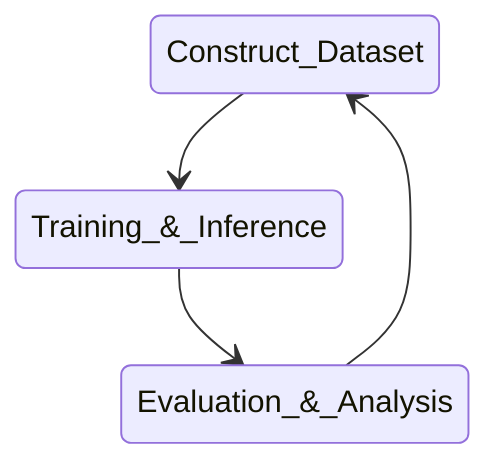

 <nav class="simple-nav" style="display: flex; justify-content: space-between; margin: 20px 0; padding: 15px 0; border-top: 2px solid #c2956cff;">  <a href="First Attempt" style="color: #c2956cff; text-decoration: none; font-weight: 600; padding: 8px 16px; border: 2px solid #c2956cff; border-radius: 4px; transition: all 0.3s ease;">Next Post →</a> </nav>
# Objective

*gnatt chart?*

The overall goal and deliverable for my first couple weeks was very straightforward: Fine tune a LLM to identify the 'peaks' on [[Cyclic Voltammograms|electrochemical plots]]. 

Automating this process presents an interesting multimodal machine learning challenge. This a great jump for me into ML workflows while producing some potentially useful outputs.

> [!note]
>  These peaks hold important information about the chemical composition of the sample. Making a model that can find the peaks is a good first step to making a model that analyze CV's on a deeper level.
# Background Context
This first project was less about making a model to find peaks and more about getting familiar tools and process of machine learning: **Dataset, Training, Evaluation**.

This foundational experience laid the groundwork for more complex future contributions to the lab's goals.

# Implementation

#### Dataset Creation Pipeline

I built a Python pipeline to convert raw electrochemical lab data into machine learning training examples. First, I manually annotating 200 cyclic voltammograms with peak locations. To streamline annotation, I created a custom web tool using Flask that let me quickly label the raw data.

Next I randomly sampled CV's to assemble graphs, allowing me to scale up my dataset to 25k samples while keeping enough variation in the dataset. Finally I made a different script to easily format the dataset into the messages format and uploaded it to Hugging-Face to access while training remotely.

*Pointing web app or something here*

#### Model Training Infrastructure

I configured a remote training environment using Docker containers for consistency. The training pipeline used ModelScope Swift framework with LoRA (Low-Rank Adaptation) for parameter-efficient fine-tuning and full Vit training. This let me efficiently train a 4B weight model on a budget. 

I fine-tuned Alibaba's Qwen2.5-VL on my multi-modal dataset and performed inference on a validation dataset and holdout set composed of separate raw data (withheld from entire training pipeline)

> [!note]
> Many actions were taken like using lora or data augmentation to increase efficiency, getting great results without increasing the budget.

_[Figure showing multimodal training process?]_

#### Evaluation Framework

I implemented a solution using accuracy and F1-scores, with the Hungarian algorithm for optimal matching between predicted and ground truth peak locations. This let me handle the problem of matching the model's guesses to the ground truth. The main metric to improve was accuracy while the components of F1 score like precision and recall told me if the model was over or underestimating points.

Beyond quantitative metrics, I built a web application for qualitative error analysis that displayed side-by-side model predictions versus ground truth. This tool let me rapidly identify patterns where the model was failing and was crucial to solve the problems that came up.

_[Evaluation dashborad?]_

# Challenges & Solutions

The primary challenge for this first project was learning new tools across multiple domains simultaneously. Initially, I relied on guidance from supervisors to overcome basic hurdles and debugging but quickly developed independence as I gained familiarity and confidence with the workflow.

The main technical challenges were with vision transformer configuration and un-normalized data. During early training runs and after a lot of digging, I discovered the vision transformer weights were frozen so the model could not "see" the graph properly. The fix was easy--modified the training script to unfreeze the necessary layers--but the challenge was learning how to trace an issue (in this case my only indication of a problem was poor performance) and identify it's root cause. 

After analyzing the results I hypothesized that certain CV combinations were preventing the model from learning.
[*example*]
I modified the training script to unfreeze the necessary layers.  A scaling issue in the dataset was distorting the input graphs. Once identified, I updated the data pipeline to normalize inputs correctly, vastly improving performance by ~30% on the next iteration.

> [!failure] Problem
> 
> Model performance was bad, there were not obvious errors and it looked like training had no impact.

> [!success] Solution
> 
> Analyzed full pipeline to identify where problems were happening. Discovered failure points and edge cases in data, fixing them and drasticaly improving performance.
# Results/Next Steps

The final model achieved 95% accuracy in peak identification on the holdout dataset :clap: The project proved my ability to take a concept from initial idea through to completed implementation, overcoming obstacles and acquiring necessary skills along the way.

This foundation project prepared me to tackle more complex challenges independently, positioning me to contribute meaningfully to the lab's larger research objectives. The experience established my capability to work autonomously, find and resolve issues, and deliver a good result.

# What I learned

- **ML Pipeline:** Hands-on experience with **Python, Docker, HuggingFace, and ModelScope Swift** for data processing, model training, evaluation as well as ML infrastructure like remote GPU clusters.
      
- **Building Custom Tools:** Built custom **internal tools** (labeling UI and analysis dashboard) that improved my workflow
      
- **Debugging & Problem-Solving:** Got much better at **systematically isolating issues** in complex systems and fixing them independently.
      
- **Project Execution:** Strengthened my ability to take projects from conception to completion — building independence, creativity, and resilience.
      
- **Independence & Communication:** Quickly transitioned from needing guidance to **working autonomously** on a collaborative project, while knowing when to ask for help and how to communicate clearly.

